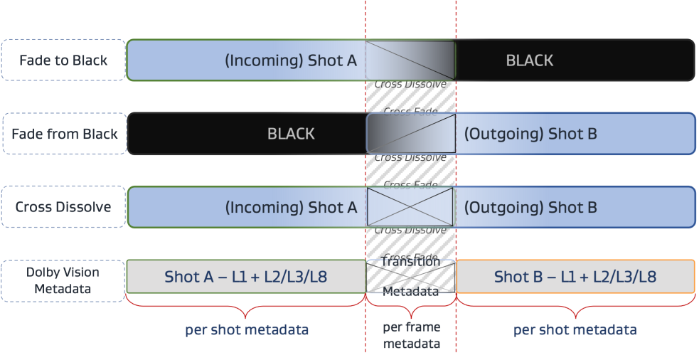
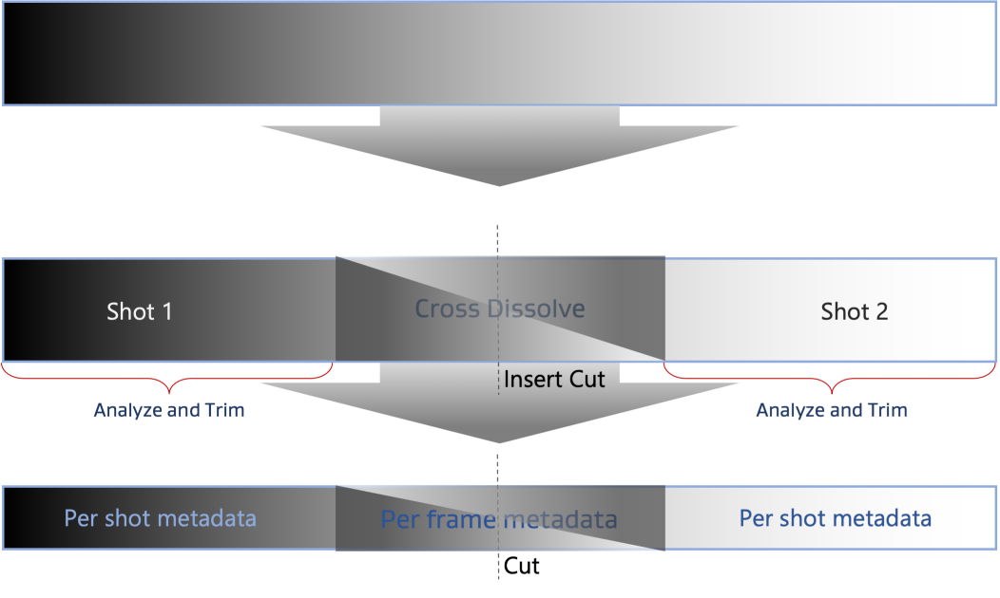

# Split The Diff

Split the difference (find the midpoint) between two numbers, fast and easy.

## The Problem

When working to apply Dolby Vision dynamic metadata on existing footage in DaVinci Resolve, one often needs to find the frame at the midpoint of a transition, say when fading in from black, fading out to black, or cross-fading between shots.

Resolve adds Dolby Vision trims per-shot by default, but creates per-frame trims (in the form of offsets from the shot trims) across a transition.

To create the per-frame metadata, you need to find the frame at the midpoint of the transition, insert a cut, apply a dissolve across the duration of the transition, and then run the DV analysis on the two shots.

### Different transitions

### Inserting the cut

## The Solution

**SplitTheDiff** makes it easy to find the frame at midpoint of transition.

1. In Resolve, mark the timeline at the start of the transition.
   - **Note**: *Using the Parade scope on the Color page can be an easy way to see beginnings/endings of a transition in luminance & chromanance, beyond what your naked eye will easily see.*
1. Mark the timeline at the end of the transition. 
1. Change the timecode display on the Cut, Edit, and/or Color pages to show the Timeline Frame.
1. Note the end frame number of the transition.
1. In **SplitTheDiff**, enter the end frame number.
   - Just start typing when the app is focused, the value will always go in one of the text fields, and it doesn't matter which number you enter first. The absolute value of the difference between them will always be displayed as the result.
1. Hit `Enter` to commit the value and move to the other text field.
1. In Resolve, navigate to the start frame of the transition.
   - `Up-Arrow` will navigate to the previous timeline mark.
1. Note the start frame number of the transition.
1. In **SplitTheDiff**, enter the start frame number.
1. Hit `Enter` to commit the value, display the result, move to the other text field, and select all the text, so the text field is ready for you to start typing a number next time.
1. The result will be the difference between the two frame positions. 
   - If the number is a decimal ending in `.5`, you can choose based on your transition which works better, to round up or down.
1. In Resolve, split the clip at the midpoint to insert a cut.
1. Insert a dissolve transition at the cut point.
1. Extend the transition until it reaches the start and end marks.
   - Hit the `Down-Arrow` to navigate the playhead to the end mark, so it's easy to extend the duration of the transition until it reaches the mark.
1. Repeat the process for all transitions, fades, pans with significant lighting changes, etc.
1. Run the Dolby Vision analysis as usual, creating per-frame metadata for all of the transitions automatically.
   - Though the [Dolby instructions](https://professionalsupport.dolby.com/s/article/Dissolves-and-Transitions-in-Dolby-Vision) do say to analyze the shots on either side of the cut first, if you're not going to make any manual adjustments to the trims, in my experience the per-frame metadata will be added regardless of whether you analyze and then add the transition or add the transition and then run the analysis. 
   
     In [a more general Dolby Vision FAQ on Resolve](https://professionalsupport.dolby.com/s/article/Dolby-Vision-in-DaVinci-Resolve-Studio-FAQs?language=en_US#trim_dissolves), Dolby backs up what I've found in my testing, that the transitions will be handled automatically:
	 
	 > **How to trim across dissolves using DaVinci Resolve?**
	 > 
	 > Dissolves and other image transitions get automatically detected by the Dolby Vision Analysis and Trims. No special treatment is necessary as analysis and trim metadata gets recorded as frame-by-frame offset metadata.
	 > 
	 > For more info on how to best handle image transitions - see this [Knowledge article](https://professionalsupport.dolby.com/s/article/Dissolves-and-Transitions-in-Dolby-Vision). 

## Other Uses

Of course, the app can be used for any other use cases where you want a purpose-built app to find the average or midpoint between two integers.